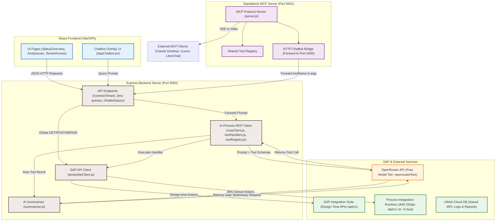

# Tenant Access Application

Tenant Access is a full-stack SAP Integration Suite / CPI utility with two main UI modules:

- `Message Monitoring Overview`
- `JMS Queues`
- `Tenant Assistant` chatbot overlay

The app has a React frontend and an Express backend. A user connects to a tenant with OAuth client credentials, then uses the app to:

- browse packages and artifacts
- trigger CPI flows
- view monitoring data stored in SAP HANA
- inspect payloads and export reports
- manage JMS queue messages with `Move`, `Retry`, and `Delete`
- ask the chatbot for the same operational data and actions available manually in the UI

## System Architecture & AI Integration

The application integrates AI operations using the Model Context Protocol (MCP) design across two configurations:

1. **In-Process MCP Client (Chatbot Overlay):** Built directly into the Express backend server. It handles conversational prompts using OpenRouter (configured to run on the free-tier `openrouter/free` model) by selecting and executing backend tools.
2. **Standalone MCP Server:** Exposes the exact same 31 backend tools to external MCP-compatible editors and clients (such as Claude Desktop, LibreChat, Open WebUI, or Cursor). It is located in the [mcp-server](file:///c:/Users/yashwanth.gr/Desktop/Tenant-Access/mcp-server) directory and supports both **Stdio** (local execution) and **SSE (Server-Sent Events)** (remote deployment over HTTP) transport modes.

### System Architecture Diagram



### What Changed in the MCP Core

New files were added under `backend/mcp`:

- `toolRegistry.js`: defines 31 AI-callable tools with names, descriptions, and JSON input schemas.
- `toolHandlers.js`: maps each tool to existing backend functions in `server.js`.
- `mcpClient.js`: sends the user prompt and tool schemas to OpenRouter and receives the selected `tool_call`.
- `summarizer.js`: makes a second OpenRouter call to summarize raw tool results into a short user-facing sentence.

`backend/server.js` was updated so `/chatbot/query` now tries the MCP flow first. If OpenRouter is not configured or the MCP call fails, the old rule-based chatbot flow still runs as fallback.

### How The AI Flow Works

```text
User prompt in AppChatbot.jsx
        |
        v
POST /chatbot/query
        |
        v
server.js handleChatbotPrompt()
        |
        v
mcpClient.js sends prompt + all tool schemas to OpenRouter
        |
        v
OpenRouter chooses one tool and fills parameters
        |
        v
toolHandlers.js executes the matching backend function
        |
        v
summarizer.js converts raw result into a short answer
        |
        v
Frontend receives { message, items, actions, pendingItems }
```

Important: OpenRouter only chooses the tool and parameters. Real SAP, HANA, SMTP, and CPI actions still happen only inside this backend. Export, ZIP, and email requests must include package/iFlow, status, and time range first; the chatbot triggers CPI with those filters before generated files should be downloaded or sent. CPI trigger dates are sent as date-only values like `2026-02-01`, so the iFlow can append `T00:00:00` for `FROM_DATE` and `T23:59:59` for `TO_DATE`.

### MCP Tools

The tool registry currently exposes these tools:

| MCP tool | What it does |
|----------|--------------|
| `get_tenant_overview` | Builds a tenant dashboard summary from monitoring, packages, and artifact data |
| `get_message_status_overview` | Groups message processing status counts by artifact/iFlow |
| `get_monitoring_logs` | Fetches CPI monitoring logs with all status and time-range filters |
| `get_monitoring_overview` | Builds a monitoring dashboard-style summary |
| `get_integration_content` | Lists integration content/artifacts with runtime or design status filters |
| `list_packages` | Lists SAP CPI integration packages |
| `list_artifacts` | Lists iFlows/artifacts for one package or all packages |
| `get_security_materials` | Looks up security materials/credentials if the tenant exposes the API |
| `get_keystores` | Looks up keystore/certificate entries if the tenant exposes the API |
| `get_pgp_keys` | Looks up PGP keys if the tenant exposes the API |
| `get_access_policies` | Looks up access policies if the tenant exposes the API |
| `get_user_roles` | Looks up user roles if the tenant exposes the API |
| `get_data_stores` | Looks up data stores or data store entries if the tenant exposes the API |
| `get_variables` | Looks up tenant/global variables if the tenant exposes the API |
| `get_number_ranges` | Looks up number ranges if the tenant exposes the API |
| `get_partner_directory` | Looks up partner directory entries if the tenant exposes the API |
| `get_message_locks` | Looks up message and designtime artifact locks if the tenant exposes the API |
| `get_system_logs` | Looks up system log files if the tenant exposes the API |
| `get_usage_details` | Looks up message usage/current month usage if the tenant exposes the API |
| `get_connectivity_tests` | Looks up connectivity tests if the tenant exposes the API |
| `export_monitoring_excel` | Requires package/iFlow, status, and time range; returns a CPI trigger action first so HANA is refreshed before Excel download |
| `download_payload_zip` | Requires package/iFlow, status, and time range; returns a CPI trigger action first so HANA contains the requested payloads before ZIP download |
| `download_payload_file` | Returns a single payload download action |
| `send_monitoring_email` | Requires email plus package/iFlow, status, and time range; triggers CPI first so the emailed Excel is based on refreshed HANA data |
| `list_jms_queues` | Lists JMS queues, optionally filtered to problem queues |
| `list_jms_messages` | Lists messages inside one JMS queue |
| `get_jms_resources` | Gets JMS broker resource/capacity details |
| `move_jms_message` | Moves one JMS message to another queue |
| `retry_jms_message` | Retries one failed JMS message |
| `delete_jms_message` | Deletes one JMS message |
| `trigger_cpi_flow` | Guides the user to the CPI trigger flow |

### Why This Helps

Before this change, the chatbot depended mostly on keyword rules. That made prompts brittle: small wording changes could select the wrong action, fetch too much data, or miss filters like package names and failed queues.

With the MCP-style flow, OpenRouter sees rich tool descriptions and schemas, so it can map natural language like `show failed JMS queues` or `artifacts in meena_demo package` to the right backend capability with structured parameters.

## UI Structure

After tenant connection, the user lands on a simple launcher screen in [frontend/src/pages/TenantAccess.jsx](C:/Users/yashwanth.gr/Desktop/Tenant-Access/frontend/src/pages/TenantAccess.jsx) with two cards:

- `JMS Queues`
- `Message Monitoring Overview`

The chatbot is mounted globally in [frontend/src/App.jsx](C:/Users/yashwanth.gr/Desktop/Tenant-Access/frontend/src/App.jsx) through [frontend/src/components/AppChatbot.jsx](C:/Users/yashwanth.gr/Desktop/Tenant-Access/frontend/src/components/AppChatbot.jsx). It appears as a floating assistant button and can answer prompts about the same operational areas available from the UI.

Frontend routes are defined in [frontend/src/App.jsx](C:/Users/yashwanth.gr/Desktop/Tenant-Access/frontend/src/App.jsx):

- `/` -> Home
- `/login` -> Login
- `/tenant` -> Tenant Access
- `/status` -> Message Monitoring Overview
- `/jms-queues` -> JMS Queues
- `/unauthorized` -> Unauthorized

## Main Pages

### 1. Message Monitoring Overview

Implemented in [frontend/src/pages/StatusOverview.jsx](C:/Users/yashwanth.gr/Desktop/Tenant-Access/frontend/src/pages/StatusOverview.jsx).

This UI is used for:

- package selection
- artifact selection
- triggering CPI
- viewing latest HANA-backed monitoring records
- payload download
- Excel export
- sending Excel by email

### 2. JMS Queues

Implemented in [frontend/src/pages/JmsQueues.jsx](C:/Users/yashwanth.gr/Desktop/Tenant-Access/frontend/src/pages/JmsQueues.jsx).

This UI is used for:

- listing available JMS queues
- viewing queue messages
- filtering queues and messages
- loading broker resource details
- moving queue messages
- retrying queue messages
- deleting queue messages

### 3. Tenant Assistant Chatbot

Implemented in [frontend/src/components/AppChatbot.jsx](C:/Users/yashwanth.gr/Desktop/Tenant-Access/frontend/src/components/AppChatbot.jsx) with backend routing in [backend/server.js](C:/Users/yashwanth.gr/Desktop/Tenant-Access/backend/server.js).

The chatbot is now AI-assisted and project-aware. OpenRouter chooses from the backend MCP tool registry, then the backend executes the matching tool. The older rule-based dispatcher is still kept as a fallback when AI is unavailable.

Supported prompt areas:

- monitoring status
- error and failed messages
- reports
- payloads
- Excel export
- payload zip download
- email report sending
- packages
- artifacts
- JMS queues
- JMS queue messages
- JMS resource details
- JMS move
- JMS retry
- JMS delete
- single payload download

Example prompts:

```text
past hour error messages
show past hour error messages
show JMS queues
show failed JMS queues
show artifacts inside meena_demo package
show messages in queue JMS_Queue_100
show JMS resources
move ID:10.147.158.688a3119dc16a96700:180 from JMS_Queue_100_DLQ to JMS_Queue_100
retry ID:10.147.158.688a3119dc16a96700:180 from JMS_Queue_100_DLQ
delete ID:10.147.158.688a3119dc16a96700:180 from JMS_Queue_100_DLQ
download excel report
download payload zip
send excel report to user@example.com
show packages
show artifacts for package All
```

Follow-up behavior:

- If the user asks for a count, such as `past hour error messages`, the chatbot gives the count and asks whether to show the rows.
- If the user replies `yes`, `show`, or `list`, the chatbot lists the pending result set.
- If AI is unavailable, the backend falls back to the older rule-based prompt handling.

## Current Frontend Runtime Config

[frontend/src/config.js](C:/Users/yashwanth.gr/Desktop/Tenant-Access/frontend/src/config.js) currently points to local backend:

```js
export const API_BASE_URL = "http://localhost:5000";
```

The deployed backend URL is still present as a commented line in that file.

## Backend Overview

Backend lives in [backend/server.js](C:/Users/yashwanth.gr/Desktop/Tenant-Access/backend/server.js).

Main responsibilities:

- tenant connection and OAuth token retrieval
- package and artifact discovery
- JMS queue and JMS message management
- CPI trigger calls
- HANA monitoring reads
- payload download
- Excel generation
- zip generation
- email sending

Backend dependencies are defined in [backend/package.json](C:/Users/yashwanth.gr/Desktop/Tenant-Access/backend/package.json).

## Backend API List

These are the current backend endpoints implemented in `server.js`.

### Tenant Connection

#### `POST /connectTenant`

Connects to SAP tenant using:

- `clientId`
- `clientSecret`
- `tokenUrl`
- `baseUrl`

Request body:

```json
{
  "clientId": "your-client-id",
  "clientSecret": "your-client-secret",
  "tokenUrl": "https://<tenant>.authentication.<region>.hana.ondemand.com/oauth/token",
  "baseUrl": "https://<tenant>.it-cpi001.cfapps.<region>.hana.ondemand.com"
}
```

Response:

```json
{
  "message": "Tenant Connected Successfully",
  "packages": [],
  "token": "access-token",
  "baseUrl": "resolved-base-url",
  "credentialSource": "trigger-env or request-env"
}
```

### Package And Artifact APIs

#### `POST /getArtifacts`

Fetches artifacts for one package or for all packages.

Request body:

```json
{
  "packageId": "All",
  "token": "tenant-access-token",
  "baseUrl": "https://<tenant>.it-cpi001.cfapps.<region>.hana.ondemand.com"
}
```

Response includes:

- `artifacts`
- `packages`
- `baseUrl`
- `cached`
- `partial`
- `failedPackages`

### Chatbot API

#### `POST /chatbot/query`

Processes a prompt through the MCP tool-calling flow and dispatches it to the same backend capabilities used by the manual UI. If AI is unavailable, the rule-based dispatcher is used as fallback.

Request body:

```json
{
  "prompt": "past hour error messages",
  "token": "tenant-access-token",
  "baseUrl": "https://<tenant>.it-cpi001.cfapps.<region>.hana.ondemand.com",
  "packages": []
}
```

Response shape:

```json
{
  "message": "Found 5 matching monitoring message(s) in the past hour. Do you want to see them?",
  "items": [],
  "pendingItems": [],
  "actions": [],
  "notApplicable": false
}
```

Main response fields:

- `message`: chatbot text shown to the user
- `items`: rows to display immediately
- `pendingItems`: rows saved for a follow-up `yes`, `show`, or `list`
- `actions`: downloadable or executable actions, such as Excel export
- `notApplicable`: true when the prompt is outside the application domain

Supported backend dispatch:

- monitoring report count/list from HANA
- error and status filtering
- payload zip action
- Excel download action
- email action when an email address is provided
- package listing from local session data
- artifact listing from CPI APIs
- JMS queue listing
- JMS queue message listing
- JMS resource details
- JMS move execution
- JMS retry execution
- JMS delete execution

AI/MCP implementation files:

- [backend/mcp/toolRegistry.js](C:/Users/yashwanth.gr/Desktop/Tenant-Access/backend/mcp/toolRegistry.js)
- [backend/mcp/toolHandlers.js](C:/Users/yashwanth.gr/Desktop/Tenant-Access/backend/mcp/toolHandlers.js)
- [backend/mcp/mcpClient.js](C:/Users/yashwanth.gr/Desktop/Tenant-Access/backend/mcp/mcpClient.js)
- [backend/mcp/summarizer.js](C:/Users/yashwanth.gr/Desktop/Tenant-Access/backend/mcp/summarizer.js)

### Message Monitoring Overview APIs

These are used by the `Message Monitoring Overview` UI.

#### `POST /getMessages`

Reads CPI message processing logs from the tenant API.

Request body:

```json
{
  "token": "tenant-access-token",
  "baseUrl": "https://<tenant>.it-cpi001.cfapps.<region>.hana.ondemand.com",
  "status": "COMPLETED",
  "artifactName": "All",
  "fromDate": "2026-03-01T00:00:00",
  "toDate": "2026-03-10T23:59:59"
}
```

#### `POST /trigger-cpi`

Triggers CPI with selected filter values.

Typical request:

```json
{
  "BASE_URL": "https://<tenant>.it-cpi001.cfapps.<region>.hana.ondemand.com",
  "IFLOW_NAME": "All",
  "STATUS": "",
  "FROM_DATE": "2026-03-01T00:00:00",
  "TO_DATE": "2026-03-10T23:59:59"
}
```

#### `POST /post-selection`

Alternative CPI trigger endpoint.

Request body:

```json
{
  "iflowName": "IF_SAMPLE",
  "status": "COMPLETED",
  "fromDate": "2026-03-01T00:00:00",
  "toDate": "2026-03-10T23:59:59"
}
```

#### `GET /latest-report`

Returns monitoring rows from HANA.

Response:

```json
{
  "reports": []
}
```

#### `GET /payload-file`

Fetches a single payload file.

Query params:

- `mplId`
- `logStart`
- `attachmentTimestamp`

#### `GET /export-reports-excel`

Exports the current monitoring report as Excel.

#### `POST /send-excel-email`

Emails the generated Excel file.

Request body:

```json
{
  "from": "sender@example.com",
  "to": "receiver@example.com",
  "subject": "Monitoring Overview of Iflow"
}
```

#### `GET /download-reports-zip`

Downloads all available payload files as a zip archive.

### JMS Queues APIs

These are used by the `JMS Queues` UI.

#### `POST /jms-queues`

Fetches queue list.

Request body:

```json
{
  "token": "tenant-access-token",
  "baseUrl": "https://<tenant>.it-cpi001.cfapps.<region>.hana.ondemand.com"
}
```

Response:

```json
{
  "queues": [
    {
      "id": "queue-id",
      "key": "queue-id",
      "name": "JMS_Queue_100",
      "accessType": "Non-Exclusive",
      "usage": "OK",
      "state": "Started",
      "entries": 5
    }
  ]
}
```

#### `POST /jms-messages`

Fetches messages for a selected queue.

Request body:

```json
{
  "token": "tenant-access-token",
  "baseUrl": "https://<tenant>.it-cpi001.cfapps.<region>.hana.ondemand.com",
  "queueName": "JMS_Queue_100",
  "queueKey": "JMS_Queue_100"
}
```

Response:

```json
{
  "messages": [
    {
      "id": "internal-id",
      "jmsMessageId": "ID:10.147.158.688a3119dc16a96700:180",
      "messageId": "correlation-or-mpl-id",
      "failed": true,
      "status": "Failed",
      "dueAt": "2026-04-29 12:00:00",
      "createdAt": "2026-04-29 11:00:00",
      "retainUntil": "2026-05-01 11:00:00",
      "retryCount": "3",
      "nextRetryOn": "2026-04-29 12:30:00",
      "correlationId": "correlation-id",
      "iflowName": "SampleIflow",
      "packageName": "SamplePackage"
    }
  ]
}
```

#### `POST /jms-resource-details`

Fetches broker resource details for `Broker1`.

Request body:

```json
{
  "token": "tenant-access-token",
  "baseUrl": "https://<tenant>.it-cpi001.cfapps.<region>.hana.ondemand.com",
  "brokerKey": "Broker1"
}
```

#### `POST /jms-messages/move`

Moves selected JMS messages from one queue to another.

Request body:

```json
{
  "token": "tenant-access-token",
  "baseUrl": "https://<tenant>.it-cpi001.cfapps.<region>.hana.ondemand.com",
  "sourceQueueName": "JMS_Queue_100_DLQ",
  "targetQueueName": "JMS_Queue_100",
  "messages": [
    {
      "jmsMessageId": "ID:10.147.158.688a3119dc16a96700:180",
      "failed": true
    }
  ]
}
```

Current behavior:

- first tries a direct API route against `.../api/v1`
- fetches CSRF token from `.../api/v1/`
- loads queue entity
- sends direct queue move request using:

```text
PATCH /api/v1/Queues('<sourceQueue>')?operation=move&target_queue=<targetQueue>&selector=JMSMessageID='<messageId>'
```

- if direct route fails, backend still has fallback move attempts

This direct route is the one currently proven to work from your backend.

#### `POST /jms-messages/retry`

Retries selected JMS messages.

Request body:

```json
{
  "token": "tenant-access-token",
  "baseUrl": "https://<tenant>.it-cpi001.cfapps.<region>.hana.ondemand.com",
  "sourceQueueName": "JMS_Queue_100_DLQ",
  "messages": [
    {
      "jmsMessageId": "ID:10.147.158.688a3119dc16a96700:180",
      "failed": true
    }
  ]
}
```

Current retry flow in backend:

- tries direct queue retry first:

```text
PATCH /api/v1/Queues('<sourceQueue>')?operation=retry&selector=JMSMessageID='<messageId>'
```

- if that fails, tries batch-based retry
- if that also fails, tries a direct `JmsMessages(...)` merge-style fallback
- route currently exists and is testable from UI

#### `POST /jms-messages/delete`

Deletes selected JMS messages.

Request body:

```json
{
  "token": "tenant-access-token",
  "baseUrl": "https://<tenant>.it-cpi001.cfapps.<region>.hana.ondemand.com",
  "sourceQueueName": "JMS_Queue_100_DLQ",
  "messages": [
    {
      "jmsMessageId": "ID:10.147.158.688a3119dc16a96700:180",
      "failed": true
    }
  ]
}
```

Delete uses:

```text
DELETE /api/v1/JmsMessages(Msgid='<msgId>',Name='<queueName>',Failed=true|false)
```

This path is currently working.

### Debug APIs

#### `POST /cpi-data`
#### `GET /cpi-data`

Temporary in-memory debug endpoints for received CPI data.

## How The Two UIs Work

### Message Monitoring Overview Flow

1. Connect tenant on `/tenant`
2. Frontend stores:
   - `token`
   - `baseUrl`
   - `packages`
   - `tenantAccessComplete`
3. Open `/status`
4. Load monitoring data from backend
5. Trigger CPI, refresh reports, download payloads, export Excel, or send email

### JMS Queues Flow

1. Connect tenant on `/tenant`
2. Open `/jms-queues`
3. Frontend loads queue list through `/jms-queues`
4. Select queue to load queue messages through `/jms-messages`
5. Use:
   - `Move`
   - `Retry`
   - `Delete`
   - `Usage`

Frontend notes from current code:

- `Retry` button is disabled if any selected message has status `Waiting`
- `Delete` uses typed confirmation: user must type `DELETE`
- `Move` opens target queue dialog

### Tenant Assistant Chatbot Flow

1. User clicks the floating assistant button.
2. User enters a prompt.
3. Frontend sends `POST /chatbot/query` with:
   - prompt
   - tenant token
   - tenant base URL
   - stored packages
4. Backend calls `runMcpChat` from `backend/mcp/mcpClient.js`.
5. OpenRouter receives the prompt plus the 31 tool schemas.
6. OpenRouter returns a selected tool and structured arguments.
7. `toolHandlers.js` executes the selected operation using existing `server.js` functions.
8. `summarizer.js` turns the raw result into a concise answer.
9. Frontend renders:
   - text answer
   - matching rows
   - follow-up list results
   - download/action buttons

If OpenRouter is not configured or the MCP flow fails, `server.js` falls back to the old rule-based chatbot logic.

## Environment Variables

Create `backend/.env`.

### Required for tenant OAuth

- `TOKEN_URL`
- `CLIENT_ID`
- `CLIENT_SECRET`

### Required for CPI triggering

- `CPI_TRIGGER_ENDPOINT`

Optional trigger credentials:

- `TRIGGER_CLIENT_ID`
- `TRIGGER_CLIENT_SECRET`
- fallback to `IFLOW_CLIENT_ID`
- fallback to `IFLOW_CLIENT_SECRET`
- fallback to `CLIENT_ID`
- fallback to `CLIENT_SECRET`

### Required for HANA

- `HANA_SERVER`
- `HANA_USER`
- `HANA_PASSWORD`

### Required for Email

- `SMTP_HOST`
- `SMTP_PORT`
- `SMTP_USER`
- `SMTP_PASS`

Optional:

- `SMTP_FROM`

### Required for AI/MCP Chatbot

- `OPENAI_API_KEY` or `AI_INTENT_API_KEY`
- `AI_INTENT_MODEL`
- `AI_INTENT_APP_URL`
- `AI_INTENT_APP_NAME`

Example:

```env
OPENAI_API_KEY=your-openrouter-key
AI_INTENT_MODEL=nex-agi/nex-n2-pro:free
AI_INTENT_APP_URL=http://localhost:5173
AI_INTENT_APP_NAME=Tenant Access
```

Optional:

- `AI_SUMMARIZER_MODEL`

## Local Development

### Backend

```powershell
cd backend
npm install
npm start
```

or

```powershell
cd backend
npm run dev
```

### Frontend

```powershell
cd frontend
npm install
npm run dev
```

### Frontend Build

```powershell
cd frontend
npm run build
```

### Standalone MCP Server

The standalone MCP server supports both `Stdio` transport for local clients and `SSE` transport for remote cloud hosting.

#### 1. Setup Environment
Define a `.env` in the `mcp-server` directory (or configure them as environment variables on your cloud provider):
```env
BACKEND_URL=http://localhost:5000     # Address of your running Express backend
BASE_URL=https://your-tenant-dt.com   # SAP CPI Design-Time URL (optional, fallback)
TOKEN_URL=https://your-tenant-oauth   # SAP CPI OAuth Endpoint (optional, fallback)
CLIENT_ID=your-client-id              # SAP CPI OAuth Client ID (optional, fallback)
CLIENT_SECRET=your-client-secret      # SAP CPI OAuth Client Secret (optional, fallback)
```

#### 2. Run Locally via Stdio
To start the server using stdio transport (e.g. for connecting to Claude Desktop locally):
```powershell
cd mcp-server
npm start
```

#### 3. Run Locally/Remotely via SSE (HTTP)
To start the server using SSE transport (exposing endpoints over HTTP):
```powershell
cd mcp-server
# Using environment variables
$env:PORT="5001"; $env:SSE="true"; node server.js
```
The server will boot and expose:
*   **SSE Handshake Endpoint:** `http://localhost:5001/sse`
*   **Message Processing Endpoint:** `http://localhost:5001/messages`

#### 4. Configure Claude Desktop Client
To add the local MCP server to Claude Desktop, open your `claude_desktop_config.json` and insert:
```json
{
  "mcpServers": {
    "sap-cpi-tenant-access": {
      "command": "node",
      "args": [
        "c:/Users/yashwanth.gr/Desktop/Tenant-Access/mcp-server/server.js"
      ],
      "env": {
        "BACKEND_URL": "http://localhost:5000"
      }
    }
  }
}
```

## Important Notes

- App login is still local UI login, not SAP IAS
- current frontend API base is local backend
- JMS `Move` direct API route is working from backend
- JMS `Delete` is working
- JMS `Retry` route exists and should be tested against your tenant with failed messages
- HANA monitoring data is still a core part of the `Message Monitoring Overview` UI
- Chatbot now uses OpenRouter MCP-style tool calling first, with rule-based fallback
- Do not commit `.env` or API keys. Rotate the OpenRouter key immediately if it is exposed.

## Quick Test Flow

1. Start backend
2. Start frontend
3. Log in with local app credentials
4. Connect tenant on `/tenant`
5. Test `Message Monitoring Overview`
6. Test `JMS Queues`
7. For JMS:
   - load queues
   - open a queue
   - select failed messages
   - test `Move`
   - test `Retry`
   - test `Delete`
8. For chatbot:
   - click the assistant button
   - ask `past hour error messages`
   - reply `yes`
   - ask `show JMS queues`
   - ask `show failed JMS queues`
   - ask `show artifacts inside meena_demo package`
   - ask `download excel report`

## Files To Know

- [backend/server.js](C:/Users/yashwanth.gr/Desktop/Tenant-Access/backend/server.js)
- [backend/mcp/toolRegistry.js](C:/Users/yashwanth.gr/Desktop/Tenant-Access/backend/mcp/toolRegistry.js)
- [backend/mcp/toolHandlers.js](C:/Users/yashwanth.gr/Desktop/Tenant-Access/backend/mcp/toolHandlers.js)
- [backend/mcp/mcpClient.js](C:/Users/yashwanth.gr/Desktop/Tenant-Access/backend/mcp/mcpClient.js)
- [backend/mcp/summarizer.js](C:/Users/yashwanth.gr/Desktop/Tenant-Access/backend/mcp/summarizer.js)
- [backend/package.json](C:/Users/yashwanth.gr/Desktop/Tenant-Access/backend/package.json)
- [frontend/src/App.jsx](C:/Users/yashwanth.gr/Desktop/Tenant-Access/frontend/src/App.jsx)
- [frontend/src/config.js](C:/Users/yashwanth.gr/Desktop/Tenant-Access/frontend/src/config.js)
- [frontend/src/pages/TenantAccess.jsx](C:/Users/yashwanth.gr/Desktop/Tenant-Access/frontend/src/pages/TenantAccess.jsx)
- [frontend/src/pages/StatusOverview.jsx](C:/Users/yashwanth.gr/Desktop/Tenant-Access/frontend/src/pages/StatusOverview.jsx)
- [frontend/src/pages/JmsQueues.jsx](C:/Users/yashwanth.gr/Desktop/Tenant-Access/frontend/src/pages/JmsQueues.jsx)
